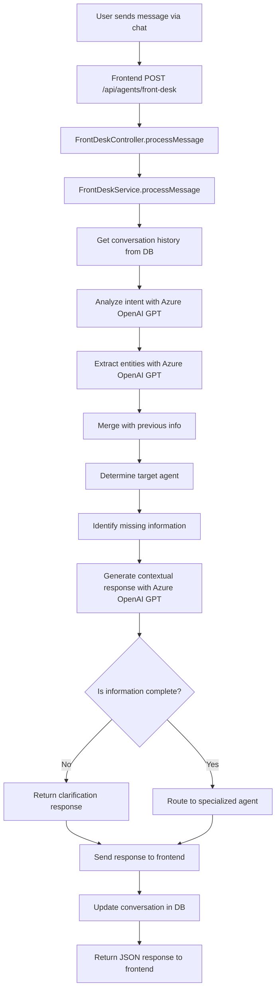

# 🔄 Current Chat Flow: From Message Reception to Agent Processing

## Overview
This document details the complete flow of how messages are received, processed, and routed through the meta-agent system, starting from the chat interface to the specialized agents.

## 📊 Complete Flow Diagram



## 📥 1. Message Reception

### Frontend Request
When a user sends a message through the chat interface, the frontend makes a POST request to:
```
POST /api/agents/front-desk
```

#### Request Body Format
```json
{
  "message": "Quiero crear un video corto para TikTok sobre mi producto nuevo",
  "context": {
    "sessionId": "user-session-123",
    "language": "es"
  }
}
```

### Backend Endpoint
The request is handled by the [FrontDeskController](file:///c%3A/MisyBot/Misy-Agent/meta-agent/backend/backend-refactor/src/agents/front-desk/controllers/front-desk.controller.ts#L12-L13) which calls the [processMessage](file:///c%3A/MisyBot/Misy-Agent/meta-agent/backend/refactor/src/agents/front-desk/services/front-desk.service.ts#L19-L72) method in [FrontDeskService](file:///c%3A/MisyBot/Misy-Agent/meta-agent/backend/backend-refactor/src/agents/front-desk/services/front-desk.service.ts#L7-L72).

## 🧠 2. Message Processing Flow

### Step 1: Retrieve Conversation History
The service first retrieves the conversation history for the given session ID from the database using [getConversationHistory](file:///c%3A/MisyBot/Misy-Agent/meta-agent/backend/backend-refactor/src/agents/front-desk/services/front-desk.service.ts#L297-L305):

```typescript
const conversationHistory = await this.getConversationHistory(sessionId);
```

This provides context for the AI to understand the ongoing conversation.

### Step 2: Intent Analysis with Azure OpenAI GPT
The system uses the [analyzeIntentWithAI](file:///c%3A/MisyBot/Misy-Agent/meta-agent/backend/backend-refactor/src/agents/front-desk/services/front-desk.service.ts#L74-L140) method to determine what the user wants to do:

```typescript
const intentAnalysis = await this.analyzeIntentWithAI(
  message,
  conversationHistory,
);
```

The AI is prompted with a coaching-oriented system message:
```
You are a coaching AI assistant that helps users discover and create viral content products. 
Your role is to understand what the user really wants to create and guide them toward viral content creation.
Identify what the user wants to do from these categories:
- generate_video: Create a viral video content
- schedule_post: Schedule a high-engagement social media post
- analyze_trends: Analyze social media trends to find viral opportunities
- faq_response: Answer questions about content creation
- generate_report: Generate analytics reports for content optimization
```

The AI returns a structured response:
```json
{
  "objective": "generate_video",
  "confidence": 0.9
}
```

### Step 3: Entity Extraction with Azure OpenAI GPT
The system extracts relevant information using [extractEntitiesWithAI](file:///c%3A/MisyBot/Misy-Agent/meta-agent/backend/backend-refactor/src/agents/front-desk/services/front-desk.service.ts#L142-L217):

```typescript
const collectedInfo = await this.extractEntitiesWithAI(
  message,
  intentAnalysis.currentObjective,
  conversationHistory,
);
```

The AI is prompted to extract viral content elements:
```
You are a coaching AI assistant that helps users discover what viral content they want to create.
Based on the user's objective ("generate_video"), extract information that will help them create viral content:

For generate_video:
- platform: social media platform where viral videos perform best (tiktok, instagram, youtube)
- topic: what the user is passionate about or what problem they want to solve
- viral_elements: what makes this video likely to go viral (humor, education, controversy, emotion)
- target_audience: who should see this video
- duration: optimal length for engagement (15s, 30s, 60s)
- narration: boolean (true/false)
- subtitles: boolean (true/false)
- music: boolean (true/false)
```

### Step 4: Information Merging
The system merges newly extracted information with previously collected information using [mergeWithPreviousInfo](file:///c%3A/MisyBot/Misy-Agent/meta-agent/backend/backend-refactor/src/agents/front-desk/services/front-desk.service.ts#L378-L395):

```typescript
const mergedInfo = this.mergeWithPreviousInfo(
  collectedInfo,
  conversationHistory,
);
```

### Step 5: Target Agent Determination
The system determines which specialized agent should handle the request using [determineTargetAgent](file:///c%3A/MisyBot/Misy-Agent/meta-agent/backend/backend-refactor/src/agents/front-desk/services/front-desk.service.ts#L397-L412):

```typescript
const targetAgent = this.determineTargetAgent(
  intentAnalysis.currentObjective,
);
```

Mapping:
- `generate_video` → `video-scriptor`
- `schedule_post` → `post-scheduler`
- `analyze_trends` → `trend-scanner`
- `faq_response` → `faq-responder`
- `generate_report` → `analytics-reporter`

### Step 6: Missing Information Identification
The system identifies what information is still needed using [identifyMissingInfo](file:///c%3A/MisyBot/Misy-Agent/meta-agent/backend/backend-refactor/src/agents/front-desk/services/front-desk.service.ts#L414-L453):

```typescript
const missingInfo = this.identifyMissingInfo(
  intentAnalysis.currentObjective,
  mergedInfo,
);
```

### Step 7: Contextual Response Generation
The system generates an appropriate response using [generateContextualResponseWithAI](file:///c%3A/MisyBot/Misy-Agent/meta-agent/backend/backend-refactor/src/agents/front-desk/services/front-desk.service.ts#L219-L308):

```typescript
const agentResponse = await this.generateContextualResponseWithAI(
  message,
  intentAnalysis,
  mergedInfo,
  missingInfo,
  conversationHistory,
);
```

The AI is prompted to create coaching-oriented responses:
```
You are a coaching AI assistant helping users discover what viral content they want to create.
The user wants to generate_video.
We still need: plataforma, duración, tema.
Ask for the missing information in a way that helps them think about what would make their content viral.
Guide them to think about their audience and what would engage them.
Use emojis to make it engaging.
Write in Spanish.
```

## 🎯 3. Decision Making

### Completeness Check
The system determines if enough information has been collected:

```typescript
const isComplete =
  missingInfo.length === 0 && intentAnalysis.confidence > 0.8;
```

### Response Routing
Based on completeness:
- **Incomplete**: Return clarification response to user
- **Complete**: Route to specialized agent

## 💾 4. Database Persistence

The conversation is saved to the database using TypeORM:

```typescript
const conversation = this.conversationRepository.create({
  sessionId,
  userMessage: message,
  agentResponse,
  objective: intentAnalysis.currentObjective,
  targetAgent: isComplete ? targetAgent : '',
  collectedInfo: mergedInfo,
  missingInfo,
  language: context?.language || 'es',
  confidence: intentAnalysis.confidence,
});

await this.conversationRepository.save(conversation);
```

## 📤 5. Response to Frontend

### Incomplete Information Response
```json
{
  "agent": "front-desk",
  "status": "clarification_needed",
  "conversation": {
    "userMessage": "Quiero un video",
    "agentResponse": "¿Para qué plataforma quieres crear el video? (TikTok, Instagram, YouTube, etc.)",
    "objective": "generate_video",
    "targetAgent": "",
    "collectedInfo": {},
    "missingInfo": ["plataforma", "duración", "tema"],
    "confidence": 0.9,
    "isComplete": false
  }
}
```

### Complete Information Response
```json
{
  "agent": "front-desk",
  "status": "ready",
  "conversation": {
    "userMessage": "Un video corto",
    "agentResponse": "¡Entendido! 🎬 Crearé un video de 30s para tiktok sobre \"mi producto nuevo\". ¿Es correcto?",
    "objective": "generate_video",
    "targetAgent": "video-scriptor",
    "collectedInfo": {
      "topic": "mi producto nuevo",
      "duration": "30s",
      "platform": "tiktok"
    },
    "missingInfo": [],
    "confidence": 0.9,
    "isComplete": true
  }
}
```

## 🔄 6. Specialized Agent Routing

When information is complete, the frontend can then route the request to the specialized agent indicated in the `targetAgent` field. The collected information is passed along to that agent for processing.

## 🔧 Error Handling

### Fallback Mechanisms
If Azure OpenAI services are unavailable, the system falls back to rule-based approaches:

1. **Intent Analysis Fallback**: [analyzeIntentWithHistory](file:///c%3A/MisyBot/Misy-Agent/meta-agent/backend/backend-refactor/src/agents/front-desk/services/front-desk.service.ts#L307-L376)
2. **Entity Extraction Fallback**: [extractEntities](file:///c%3A/MisyBot/Misy-Agent/meta-agent/backend/backend-refactor/src/agents/front-desk/services/front-desk.service.ts#L455-L552)
3. **Response Generation Fallback**: [generateContextualResponse](file:///c%3A/MisyBot/Misy-Agent/meta-agent/backend/backend-refactor/src/agents/front-desk/services/front-desk.service.ts#L475-L573)

### Error Logging
All AI service errors are logged for debugging:
```typescript
console.error('AI Intent Analysis Error:', _error.message);
```

## 📈 Conversation Flow Examples

### Example 1: Video Creation Flow
```
User: Quiero crear un video
Agent: ¿Para qué plataforma quieres crear el video? (TikTok, Instagram, YouTube, etc.)

User: Para TikTok
Agent: ¿Sobre qué tema quieres que sea el video?

User: Sobre mi producto nuevo
Agent: ¿Qué duración prefieres para el video? (30 segundos, 1 minuto, etc.)

User: Un video corto
Agent: ¡Entendido! 🎬 Crearé un video de 30s para tiktok sobre "o corto". ¿Es correcto?

User: Sí
Agent: ¡Perfecto! 🚀 Estoy creando tu video con el Video Scriptor...
```

### Example 2: Post Scheduling Flow
```
User: Quiero programar una publicación para Facebook sobre mis servicios
Agent: Perfecto ✅ Programaré una publicación en facebook sobre "mis servicios". ¿Es correcto?
```

## 🛠 Technical Implementation Details

### File Structure
```
src/agents/front-desk/
├── controllers/
│   └── front-desk.controller.ts
├── services/
│   └── front-desk.service.ts
├── entities/
│   └── front-desk-conversation.entity.ts
├── dto/
│   └── front-desk-request.dto.ts
└── front-desk.module.ts
```

### Dependencies
- NestJS for framework
- TypeORM for database operations
- Axios for HTTP requests to Azure OpenAI
- PostgreSQL for data persistence

### Environment Variables
```env
OPENAI_API_KEY=your_api_key
OPEN_API_ENDPOINT=https://your-azure-endpoint.cognitiveservices.azure.com/
OPENAI_DEPLOYMENT_NAME=gpt-5-chat
```

## 📊 Monitoring and Metrics

The system tracks:
- Conversation history and context
- AI confidence scores
- Information completeness
- Agent routing decisions
- Response generation effectiveness

This data is available through the agent status endpoint for dashboard monitoring.