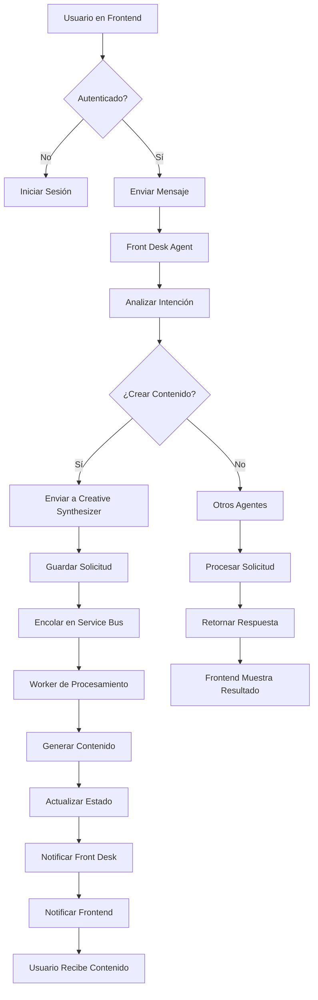

# Flujo de Integración del Sistema

## 🔄 Flujo Completo del Sistema

### 1. Inicio de Sesión y Autenticación
1. Usuario inicia sesión en el frontend (dashboard_desktop_v4)
2. Frontend recibe token de autenticación
3. Token se usa para todas las comunicaciones con el backend

### 2. Interacción con el Front Desk Agent
1. Usuario envía mensaje al chat
2. Frontend envía mensaje + token + contexto al Front Desk Agent
3. Front Desk procesa el mensaje:
   - Analiza intención y emoción
   - Extrae entidades relevantes
   - Determina agente destino
   - Mantiene contexto comprimido

### 3. Enrutamiento a Agentes Especializados
Según la intención detectada, el Front Desk puede enrutar a:

- **Creative Synthesizer Agent**: Para generación de contenido multimedia
- **Video Scriptor Agent**: Para creación de guiones de video
- **Post Scheduler Agent**: Para programación de publicaciones
- **Trend Scanner Agent**: Para análisis de tendencias
- **FAQ Responder Agent**: Para respuestas a preguntas frecuentes
- **Analytics Reporter Agent**: Para generación de reportes

### 4. Procesamiento con Creative Synthesizer Agent
Cuando se requiere generación de contenido:

1. Front Desk identifica intención de crear contenido (video, imagen, audio)
2. Front Desk envía solicitud al Creative Synthesizer con:
   ```json
   {
     "sessionId": "user-session-123",
     "userId": "alejandro",
     "intention": "generate_video",
     "emotion": "excited",
     "entities": {
       "script": "Presentamos nuestro nuevo producto...",
       "style": "tiktok",
       "duration": 30,
       "assets": ["image1.png", "audio1.mp3"]
     },
     "integrationId": "tiktok-conn-456",
     "integrationStatus": "active"
   }
   ```
3. Creative Synthesizer:
   - Guarda registro en base de datos con estado "processing"
   - Envía mensaje al Service Bus de Azure para procesamiento asíncrono
   - Retorna respuesta inmediata al Front Desk

### 5. Procesamiento Asíncrono con Service Bus
1. Worker escucha cola de Service Bus
2. Recibe solicitud de creación de contenido
3. Ejecuta proceso de generación (puede tomar varios minutos)
4. Actualiza estado en base de datos
5. Envía notificación al Front Desk cuando finaliza

### 6. Notificación al Frontend
1. Front Desk recibe notificación de finalización
2. Front Desk puede:
   - Enviar mensaje al usuario informando que el contenido está listo
   - Proporcionar enlace para ver/descargar el contenido
   - Sugerir siguientes pasos

### 7. Publicación Automática (Opcional)
Si se requiere publicación automática:

1. Front Desk o usuario solicita publicación
2. Front Desk envía solicitud al Creative Synthesizer:
   ```json
   {
     "integrationId": "tiktok-conn-456",
     "assetId": "video123",
     "caption": "Descubre nuestro nuevo producto",
     "tags": ["innovación", "viral"]
   }
   ```
3. Creative Synthesizer:
   - Actualiza estado a "publishing"
   - Envía mensaje al Service Bus para publicación
   - Retorna confirmación al Front Desk

## 📊 Diagrama de Flujo



## 🔌 Integración con Service Bus de Azure

### Configuración
El sistema utiliza el Service Bus de Azure para procesamiento asíncrono:

- **Cadena de conexión**: `process.env.SERVICE_BUS_CONNECTION_STRING`
- **Cola de creación**: `content_creation_queue`
- **Cola de publicación**: `content_publish_queue`
- **Tópico de notificaciones**: `content_notifications_topic`

### Flujo de Mensajes
1. **Solicitud de Creación**:
   - Queue: `content_creation_queue`
   - Message: Datos de creación + metadata

2. **Solicitud de Publicación**:
   - Queue: `content_publish_queue`
   - Message: Datos de publicación + asset

3. **Notificación de Finalización**:
   - Topic: `content_notifications_topic`
   - Message: Estado final + enlace al contenido

## 🛠️ Optimización del Flujo

### Ventajas del Enfoque Asíncrono
1. **Experiencia de Usuario Mejorada**: El usuario puede seguir interactuando mientras se genera el contenido
2. **Escalabilidad**: Procesos largos no bloquean el sistema principal
3. **Tolerancia a Fallos**: Procesos pueden reintentarse si fallan
4. **Monitoreo**: Cada paso se registra y puede monitorearse

### Consideraciones de Implementación
1. **Manejo de Estado**: Cada proceso debe mantener su estado para permitir reintentos
2. **Idempotencia**: Las operaciones deben ser idempotentes para evitar duplicados
3. **Timeouts**: Implementar timeouts para procesos que toman demasiado tiempo
4. **Notificaciones**: Mantener al usuario informado sobre el progreso

## 🧠 Rol del Orchestrator

El Admin Orchestrator se encarga de:

1. **Coordinar Agentes**: Asegurar que los agentes trabajen en armonía
2. **Mantener Contexto**: Compartir contexto entre agentes cuando sea necesario
3. **Gestionar Errores**: Manejar errores y fallbacks entre agentes
4. **Monitorear Salud**: Verificar que todos los agentes estén operativos
5. **Optimizar Recursos**: Distribuir carga de trabajo eficientemente

## 📈 Métricas y Monitoreo

### Métricas del Creative Synthesizer
- Tiempo promedio de generación
- Tasa de éxito/fallo
- Calidad de contenido generado
- Uso de recursos del sistema

### Métricas del Sistema
- Tiempo de respuesta del Front Desk
- Tasa de enrutamiento correcto
- Satisfacción del usuario
- Tiempo de interacción total

## 🔒 Seguridad

### Manejo de Tokens
1. Todos los requests entre frontend y backend incluyen token de autenticación
2. Los agentes validan el token antes de procesar solicitudes
3. Los workers del Service Bus no manejan directamente tokens pero reciben contexto validado

### Protección de Datos
1. Información sensible se almacena encriptada
2. Logs no incluyen datos personales
3. Acceso a base de datos restringido por roles