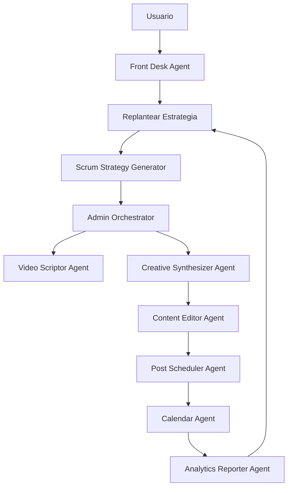

# 🎯 ViralCampaignOrchestrator

## 🧾 Descripción General

El **ViralCampaignOrchestrator** es un módulo especializado que orquesta campañas virales modulares con metodología Scrum. Actúa como el cerebro central que coordina múltiples agentes especializados para ejecutar campañas virales completas con trazabilidad emocional y métrica.

## 🎯 Propósito

Diseñar un sistema que:

- Escanee métricas en redes sociales y Google.
- Establezca una campaña viral estilo Scrum.
- Genere estrategia, fechas, y duración del proyecto.
- Envíe reporte al Admin Orchestrator para repartir funciones.
- Integre contexto emocional y técnico en cada agente.
- Genere contenido (video, imagen, audio).
- Edite profesionalmente los assets para cada red social.
- Programe publicaciones en un calendario dinámico.
- Permita reprogramación estratégica si cambian las métricas.

## 🧠 Rol Emocional

**Ruta Scrum Viral**: Orquesta, adapta y ritualiza campañas virales con trazabilidad emocional y métrica.

## 🔧 Módulos y Funciones

### 1. 📊 Trend Scanner Agent
- Conectado a APIs de TikTok, Instagram, YouTube, Google Trends.
- Extrae métricas: hashtags, formatos, engagement, CTR, CPC.
- Devuelve informe con oportunidades virales.

### 2. 🧩 Scrum Strategy Generator
- Establece duración del proyecto (ej. 7 días).
- Define etapas: discovery, scripting, creation, scheduling, publishing, analysis.
- Genera fechas y entregables por sprint.

### 3. 🧠 Admin Orchestrator
- Recibe el informe y estrategia.
- Reparte funciones a agentes especializados.
- Propaga contexto emocional y técnico a cada agente.

### 4. 🎬 Video Scriptor Agent
- Genera guiones adaptados por emoción, plataforma y formato viral.

### 5. 🎨 Creative Synthesizer Agent
- Crea contenido multimedia según guión y assets.
- Encola en Service Bus para procesamiento.

### 6. ✂️ Content Editor Agent (Nuevo módulo)
- Recibe assets generados.
- Edita tamaño, duración, formato, tags, subtítulos, estilo visual.
- Asegura cumplimiento de requisitos por red social:
  - TikTok: ≤60s, vertical, hashtags virales
  - Instagram: ≤90s, cuadrado o vertical, subtítulos
  - YouTube Shorts: ≤60s, vertical, título optimizado

### 7. 📅 Calendar Agent (Nuevo módulo)
- Recibe fechas y assets.
- Programa publicaciones según estrategia.
- Se integra con Trend Scanner y Analytics Reporter.
- Permite reprogramación si cambian métricas.

### 8. 📈 Analytics Reporter Agent
- Mide impacto emocional y métrico.
- Devuelve reporte con recomendaciones.
- Puede activar reprogramación vía Calendar Agent.

## 🔁 Flujo Modular



## 📦 Payload de Activación

```json
{
  "campaignType": "product_launch",
  "sessionId": "user-session-123",
  "emotion": "excited",
  "platforms": ["tiktok", "instagram", "youtube"],
  "durationDays": 7,
  "objective": "viral_impact",
  "agents": [
    "trend-scanner",
    "scrum-strategy",
    "video-scriptor",
    "creative-synthesizer",
    "content-editor",
    "post-scheduler",
    "calendar",
    "analytics-reporter"
  ]
}
```

## 🧬 Estados del Proceso

| Estado | Descripción |
|--------|-------------|
| initiated | Campaña activada |
| scanning | Métricas siendo analizadas |
| strategizing | Estrategia Scrum generada |
| scripting | Guiones generados |
| creating | Contenido en proceso |
| editing | Assets siendo editados |
| scheduling | Publicaciones programadas |
| publishing | Contenido publicado |
| analyzing | Métricas en análisis |
| replanning | Estrategia ajustada |
| completed | Campaña finalizada |

## 📈 Etapas de la Campaña

### 1. 🌧️ Lluvia de ideas y contexto
**Agente**: Trend Scanner
- Análisis de tendencias en redes sociales
- Identificación de oportunidades virales
- Recopilación de métricas relevantes

### 2. 📋 Estrategia Scrum
**Agente**: Scrum Strategy Generator
- Definición de sprints y entregables
- Planificación temporal del proyecto
- Asignación de recursos por etapa

### 3. 🎬 Generación de guiones
**Agente**: Video Scriptor
- Creación de guiones adaptados a plataforma y emoción
- Desarrollo de narrativas virales
- Generación de sugerencias visuales

### 4. 🎨 Creación de contenido
**Agente**: Creative Synthesizer
- Generación de assets multimedia
- Creación de contenido según guión
- Encolamiento para procesamiento

### 5. ✂️ Edición de medios
**Agente**: Content Editor
- Adaptación de assets a requisitos de plataforma
- Optimización de formato, duración y estilo
- Adición de tags y subtítulos

### 6. 📅 Programación de publicaciones
**Agente**: Post Scheduler
- Planificación temporal de publicaciones
- Distribución estratégica de contenido
- Generación de calendario de publicación

### 7. 🗓️ Calendario dinámico
**Agente**: Calendar
- Visualización interactiva del calendario
- Configuración de recordatorios
- Seguimiento de eventos programados

### 8. 📊 Monitoreo y análisis
**Agente**: Analytics Reporter
- Medición de métricas de engagement
- Análisis de performance por plataforma
- Generación de recomendaciones

## 🔒 Seguridad y Validación

- Validación de token en cada módulo
- SAS URLs en todos los assets
- Encriptación de datos sensibles
- Idempotencia en workers
- Roles definidos por agente

## 🔄 Reprogramación Estratégica

El sistema permite reprogramación automática cuando:
- Las métricas cambian significativamente
- El performance no cumple con expectativas
- Se identifican nuevas oportunidades virales
- El calendario necesita ajustes

## 📊 Métricas de Seguimiento

- **Engagement Rate**: Porcentaje de interacciones
- **Reach**: Alcance de las publicaciones
- **Conversion Rate**: Tasa de conversión
- **Sentiment Analysis**: Análisis emocional
- **Platform Performance**: Performance por plataforma

## 🎯 Integración con el Frontend

El orchestrator mantiene una trazabilidad completa de cada etapa que se puede presentar en el frontend como:

1. **Lluvia de ideas y contexto**: Revisión de tendencias identificadas
2. **Estrategia Scrum**: Plan de acción con sprints y entregables
3. **Edición de medios**: Revisión y aprobación de assets generados
4. **Programación de publicaciones**: Calendario interactivo
5. **Monitoreo**: Dashboard de métricas en tiempo real

## 🛠️ Endpoints

| Método | Endpoint | Descripción |
|--------|----------|-------------|
| POST | `/api/agents/viral-campaign-orchestrator/activate` | Activar campaña viral |
| GET | `/api/agents/viral-campaign-orchestrator/status/:campaignId` | Obtener estado de campaña |
| GET | `/api/agents/viral-campaign-orchestrator/session/:sessionId` | Obtener campañas por sesión |

## 📈 Futuras Mejoras

1. **Aprendizaje automático**: Optimización de estrategias basada en resultados históricos
2. **Integración con más plataformas**: LinkedIn, Twitter, Facebook
3. **Personalización avanzada**: Adaptación de contenido basada en audiencia
4. **Automatización completa**: Ejecución sin intervención humana