# 🔄 Front Desk Agent Flowchart

## Visual Representation of the Conversational Flow

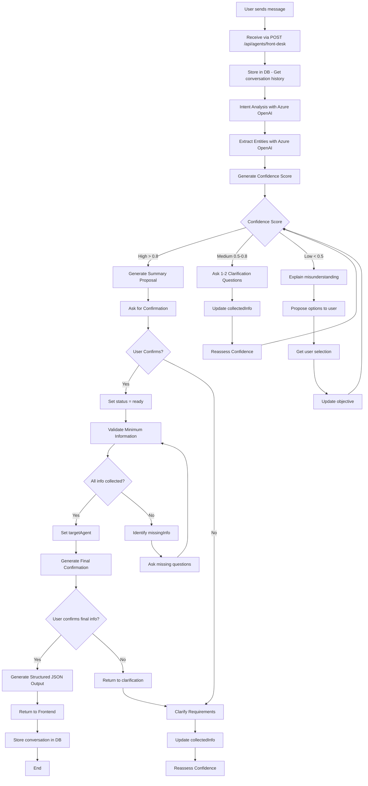

## 🎯 Detailed Flow States

### 1. Initial Reception State
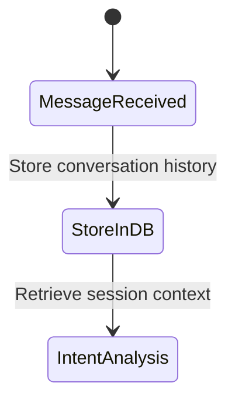

### 2. Analysis State
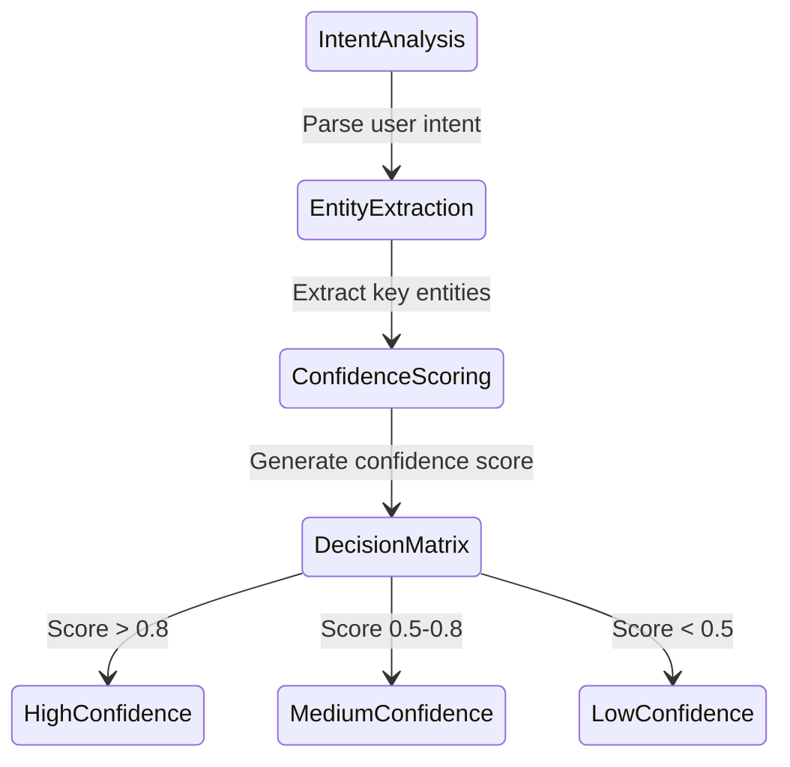

### 3. High Confidence Path
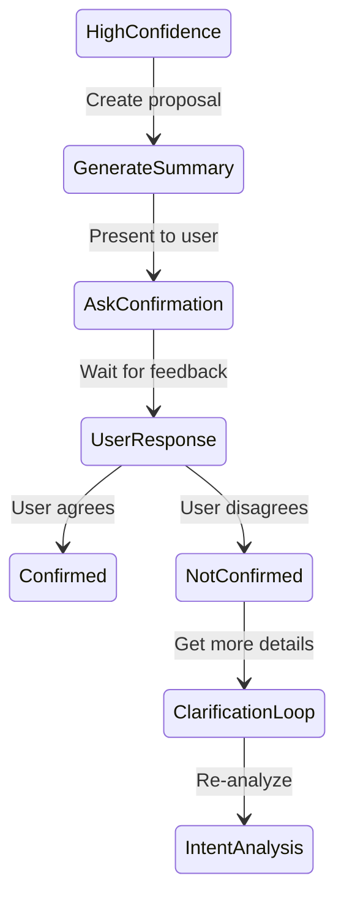

### 4. Medium Confidence Path
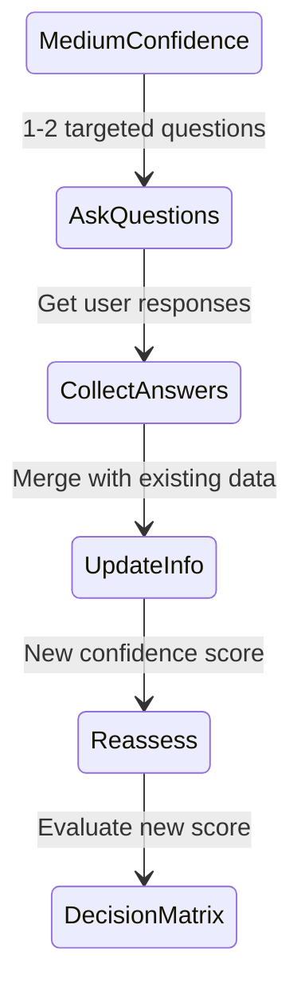

### 5. Low Confidence Path
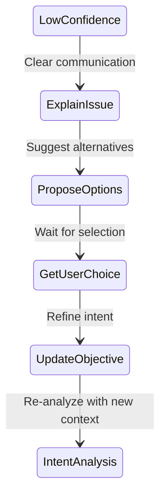

### 6. Validation and Output State
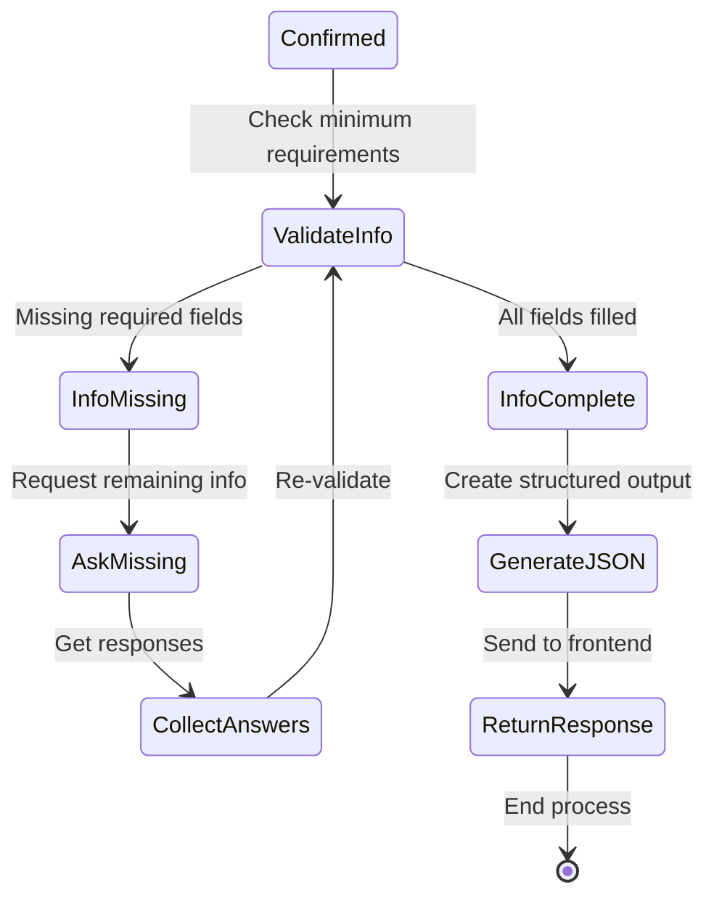

## 📊 Decision Matrix Visualization

### Confidence-Based Routing
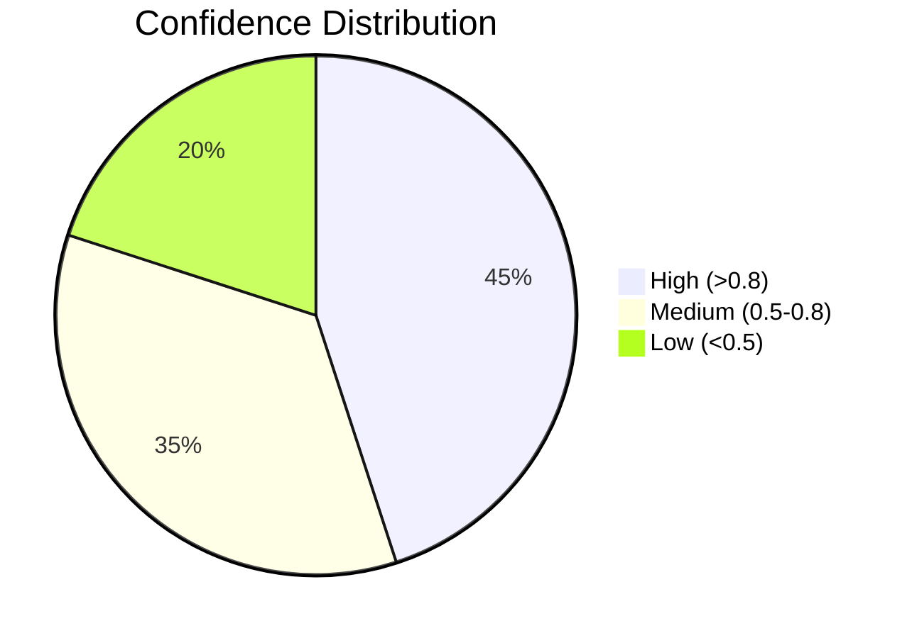

### Objective Mapping
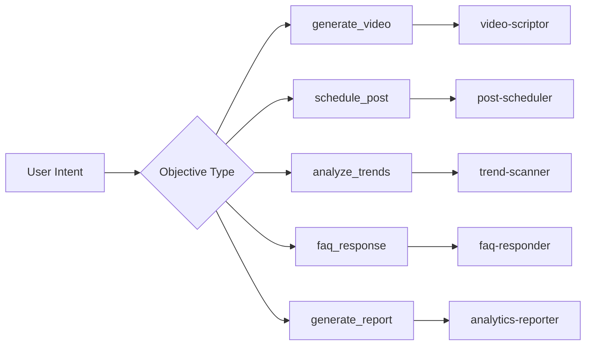

## 🛠 Process Flow with Error Handling

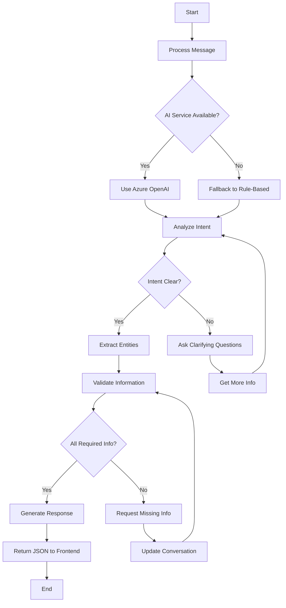

## 📈 Monitoring and Feedback Loop

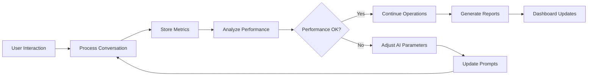

## 🎨 Response Generation Flow

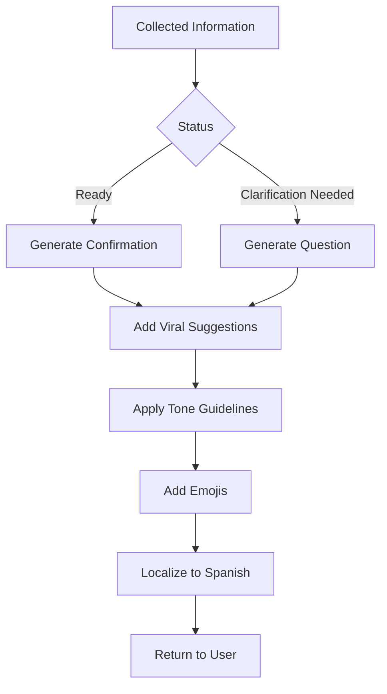

## 🔧 Technical Implementation Flow

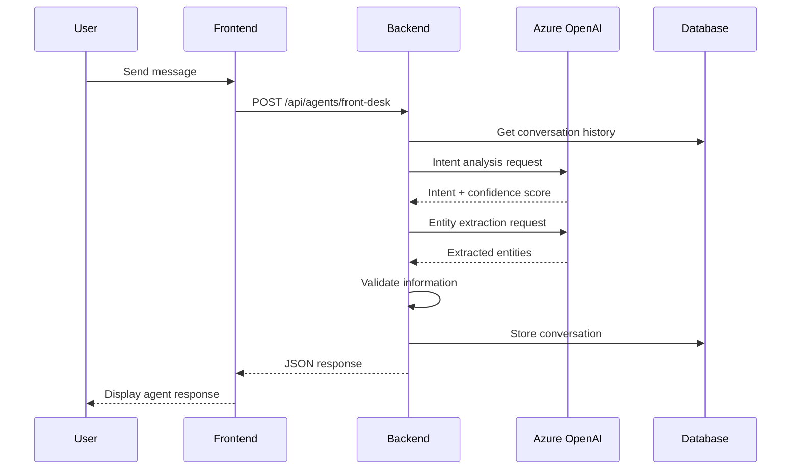

This flowchart documentation provides a comprehensive visual representation of how the Front Desk Agent processes user messages, makes decisions based on confidence scores, and routes requests to specialized agents while maintaining a guided, coaching-oriented conversation.