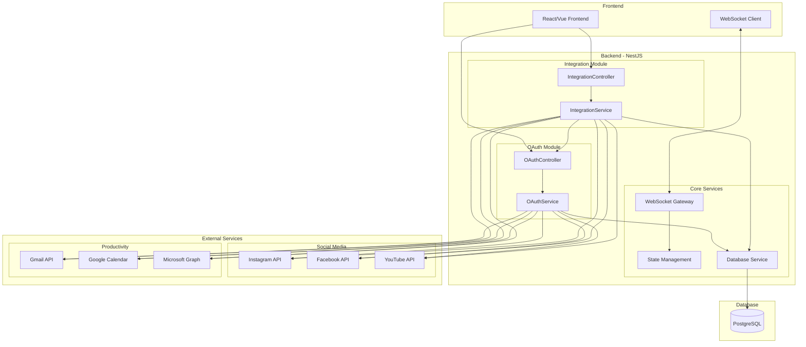
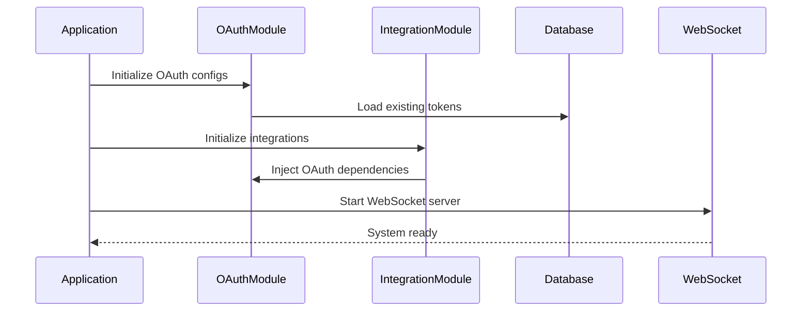
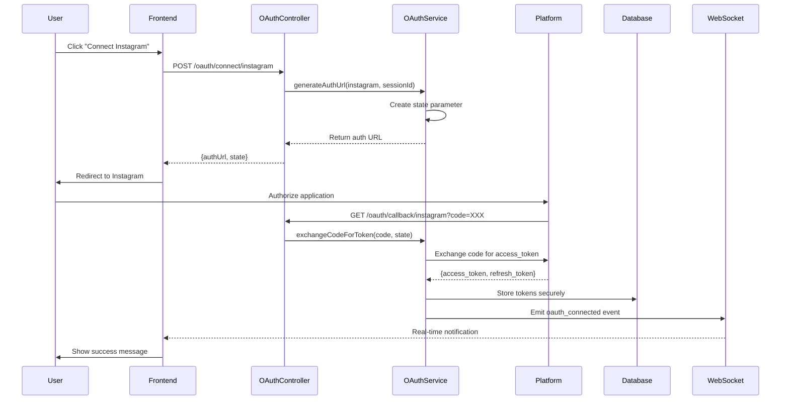
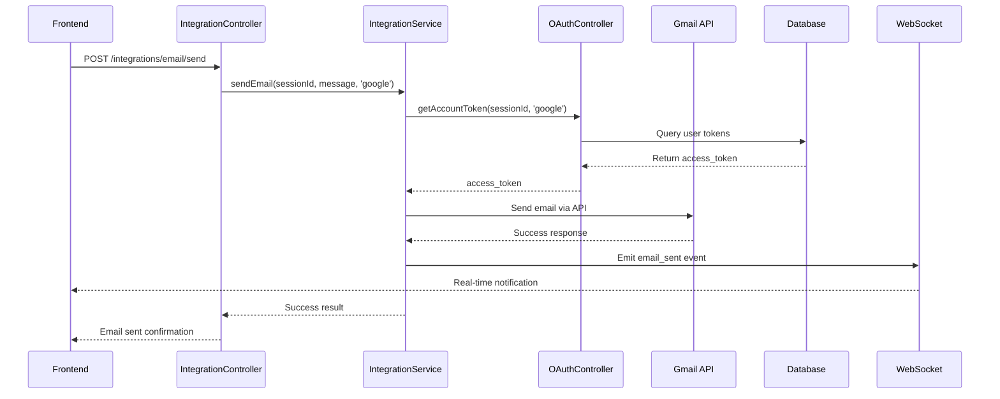

# 🏗️ Arquitectura del Sistema OAuth - Vista Completa

## 📐 Diagrama de Arquitectura General



## 🔄 Flujo de Datos Detallado

### 1. **Inicialización del Sistema**



### 2. **Proceso de Conexión OAuth Completo**



### 3. **Flujo de Envío de Email**



## 🧩 Componentes del Sistema

### **Módulo OAuth (`src/oauth/`)**
```
oauth/
├── oauth.module.ts          # Configuración del módulo
├── oauth.service.ts         # Lógica de autenticación
├── oauth.controller.ts      # Endpoints REST
└── interfaces/
    ├── oauth-config.interface.ts
    └── oauth-account.interface.ts
```

**Responsabilidades:**
- Generar URLs de autorización OAuth
- Manejar callbacks de plataformas
- Intercambiar códigos por tokens
- Gestionar refresh de tokens
- Almacenar credenciales de forma segura

### **Módulo Integration (`src/integrations/`)**
```
integrations/
├── integration.module.ts    # Configuración del módulo
├── integration.service.ts   # Llamadas a APIs externas
├── integration.controller.ts # Endpoints funcionales
└── interfaces/
    ├── email-message.interface.ts
    ├── calendar-event.interface.ts
    └── social-post.interface.ts
```

**Responsabilidades:**
- Ejecutar acciones en plataformas conectadas
- Manejar APIs específicas de cada servicio
- Validar permisos y tokens
- Formatear datos según requerimientos de cada API

### **Base de Datos - Entidades Principales**

```typescript
// OAuth Accounts
interface OAuthAccount {
  id: string;
  sessionId: string;
  platform: string;
  accessToken: string;      // Cifrado
  refreshToken?: string;    // Cifrado
  expiresAt: Date;
  userInfo: any;
  createdAt: Date;
  updatedAt: Date;
  isActive: boolean;
}

// Integration Logs
interface IntegrationLog {
  id: string;
  accountId: string;
  action: string;           // 'email_sent', 'post_published', etc.
  platform: string;
  result: 'success' | 'error';
  metadata: any;
  createdAt: Date;
}
```

## 🔐 Seguridad y Configuración

### **Variables de Entorno Requeridas**
```env
# OAuth Credentials
INSTAGRAM_CLIENT_ID=your_instagram_app_id
INSTAGRAM_CLIENT_SECRET=your_instagram_app_secret

FACEBOOK_APP_ID=your_facebook_app_id
FACEBOOK_APP_SECRET=your_facebook_app_secret

GOOGLE_CLIENT_ID=your_google_client_id
GOOGLE_CLIENT_SECRET=your_google_client_secret

MICROSOFT_CLIENT_ID=your_microsoft_client_id
MICROSOFT_CLIENT_SECRET=your_microsoft_client_secret

# System Configuration
OAUTH_REDIRECT_BASE_URL=http://localhost:3007/api/oauth/callback
DATABASE_ENCRYPTION_KEY=your_32_character_encryption_key

# Database
DATABASE_HOST=localhost
DATABASE_PORT=5432
DATABASE_USERNAME=postgres
DATABASE_PASSWORD=your_password
DATABASE_NAME=meta_agent
```

### **Scopes por Plataforma**
```typescript
const PLATFORM_SCOPES = {
  instagram: ['instagram_basic', 'instagram_content_publish'],
  facebook: ['pages_manage_posts', 'pages_read_engagement'],
  youtube: ['youtube.upload', 'youtube.readonly'],
  google: ['gmail.send', 'calendar.events'],
  microsoft: ['mail.send', 'calendars.readwrite'],
  'google-calendar': ['calendar.events'],
  'microsoft-calendar': ['calendars.readwrite']
};
```

## 📊 Monitoreo y Logs

### **Eventos WebSocket**
```typescript
// Eventos disponibles para el frontend
interface WebSocketEvents {
  'oauth_connected': {
    platform: string;
    email: string;
    sessionId: string;
  };
  
  'oauth_error': {
    platform: string;
    error: string;
    sessionId: string;
  };
  
  'email_sent': {
    platform: string;
    to: string[];
    messageId: string;
  };
  
  'social_posted': {
    platform: string;
    postId: string;
    content: string;
  };
  
  'token_refreshed': {
    platform: string;
    sessionId: string;
  };
}
```

### **Logs Estructurados**
```typescript
// Ejemplo de log de email enviado
{
  timestamp: '2024-01-15T10:30:00Z',
  level: 'info',
  module: 'IntegrationService',
  action: 'email_sent',
  platform: 'google',
  sessionId: 'user-123',
  metadata: {
    to: ['recipient@email.com'],
    subject: 'Test Email',
    messageId: 'gmail_msg_456'
  }
}
```

## 🎯 Casos de Uso Principales

### **1. Creador de Contenido**
- Conecta cuentas de Instagram, YouTube, Facebook
- Programa publicaciones automáticas
- Sube videos con metadatos optimizados
- Monitorea engagement en tiempo real

### **2. Manager de Campañas**
- Conecta múltiples cuentas de email
- Programa envío masivo de emails
- Crea eventos de calendario para campañas
- Coordina publicaciones multi-plataforma

### **3. Asistente Personal**
- Envía emails automáticos
- Crea eventos de calendario
- Publica recordatorios en redes sociales
- Mantiene sincronización entre servicios

## 🚀 Extensibilidad Futura

El sistema está diseñado para fácil extensión:

1. **Nuevas Plataformas:**
   - Agregar configuración en `OAuthService`
   - Implementar métodos específicos en `IntegrationService`
   - Actualizar interfaces TypeScript

2. **Nuevas Funcionalidades:**
   - Extender `IntegrationController` con nuevos endpoints
   - Agregar validaciones específicas
   - Implementar nuevos tipos de eventos WebSocket

3. **Mejoras de Seguridad:**
   - Implementar OAuth PKCE
   - Agregar rate limiting
   - Mejorar cifrado de tokens

Esta arquitectura permite un crecimiento escalable y mantenible del sistema OAuth.