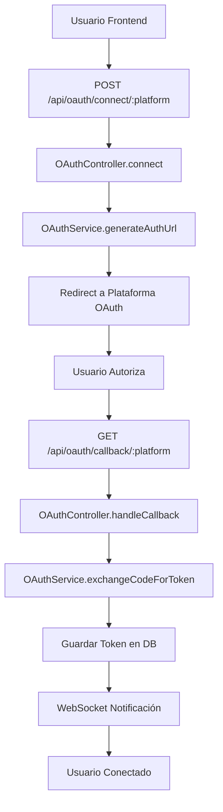
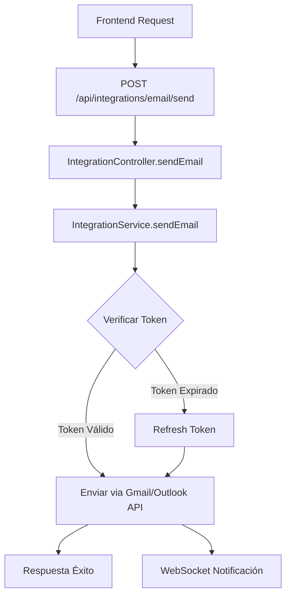
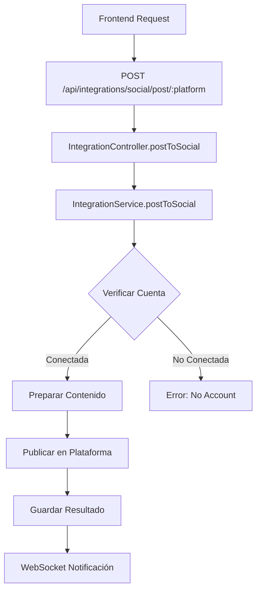
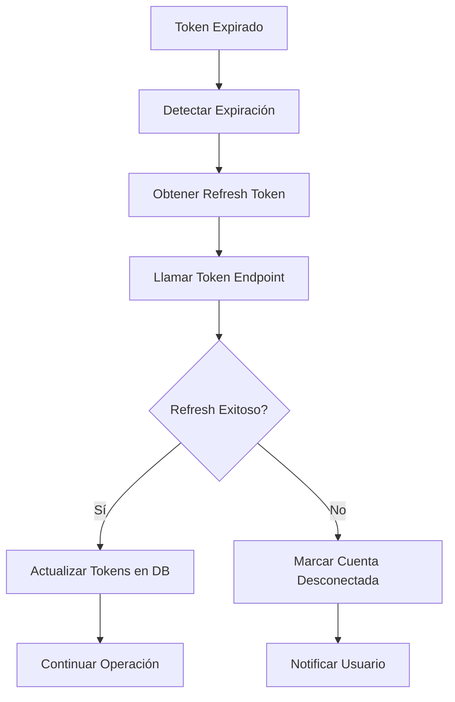

# ✅ Sistema OAuth - Checklist Completo y Flujo del Sistema

## 📋 Checklist de Implementación Completa

### 🔧 **Módulos Core Implementados**
- [x] **OAuthModule** - Gestión de autenticación OAuth
  - [x] `OAuthService` - Lógica de negocio OAuth
  - [x] `OAuthController` - Endpoints REST OAuth
  - [x] Configuraciones para todas las plataformas
  - [x] Manejo de tokens y refresh automático

- [x] **IntegrationModule** - Integraciones con plataformas
  - [x] `IntegrationService` - Llamadas a APIs externas
  - [x] `IntegrationController` - Endpoints de funcionalidades
  - [x] Servicios de email, calendario, redes sociales

### 🌐 **Plataformas OAuth Soportadas**
- [x] **Instagram** - Publicación de fotos y stories
- [x] **Facebook** - Publicación en páginas y perfiles  
- [x] **YouTube** - Subida de videos y gestión de canal
- [x] **Google** - Gmail, Google Calendar, Google Drive
- [x] **Microsoft** - Outlook, Microsoft Calendar, OneDrive
- [x] **Google Calendar** - Gestión específica de eventos
- [x] **Microsoft Calendar** - Gestión específica de eventos

### 🔗 **Endpoints OAuth Funcionales**
- [x] `GET /api/oauth/platforms` - Lista plataformas disponibles
- [x] `POST /api/oauth/connect/:platform` - Inicia flujo OAuth
- [x] `GET /api/oauth/callback/:platform` - Maneja callback OAuth
- [x] `GET /api/oauth/accounts/:sessionId` - Lista cuentas conectadas
- [x] `POST /api/oauth/disconnect` - Desconecta cuenta específica
- [x] `POST /api/oauth/refresh/:accountId` - Refresca tokens

### 📧 **Funcionalidades de Integración**
- [x] **Envío de Emails**
  - [x] `POST /api/integrations/email/send` - Envío via Gmail/Outlook
  - [x] Soporte para HTML/texto plano
  - [x] CC, BCC, adjuntos
  - [x] Validación y manejo de errores

- [x] **Gestión de Calendarios**
  - [x] `POST /api/integrations/calendar/create-event` - Crear eventos
  - [x] Soporte Google Calendar y Microsoft Calendar
  - [x] Eventos recurrentes y invitados
  - [x] Eventos de día completo

- [x] **Publicación en Redes Sociales**
  - [x] `POST /api/integrations/social/post/:platform` - Publicar contenido
  - [x] Soporte para imágenes y texto
  - [x] Programación de publicaciones
  - [x] Manejo específico por plataforma

- [x] **YouTube Específico**
  - [x] `POST /api/integrations/youtube/upload` - Subida de videos
  - [x] Metadatos completos (título, descripción, tags)
  - [x] Configuración de privacidad
  - [x] Thumbnail personalizado

### 🔐 **Seguridad y Tokens**
- [x] **Gestión Segura de Tokens**
  - [x] Almacenamiento cifrado en base de datos
  - [x] Refresh automático de tokens expirados
  - [x] Validación de estado (state parameter)
  - [x] Prevención CSRF con state único

- [x] **Configuración de Seguridad**
  - [x] Variables de entorno para credenciales
  - [x] URLs de redirect validadas
  - [x] Scopes mínimos necesarios por plataforma
  - [x] Manejo de errores sin exposición de datos

### 📡 **Comunicación en Tiempo Real**
- [x] **WebSocket Integration**
  - [x] Notificaciones de conexión OAuth exitosa
  - [x] Notificaciones de errores de autenticación
  - [x] Actualizaciones de estado de publicaciones
  - [x] Eventos de refresh de tokens

### 🗄️ **Base de Datos y Persistencia**
- [x] **Entidades y Modelos**
  - [x] Almacenamiento de tokens OAuth
  - [x] Información de cuentas conectadas
  - [x] Historial de publicaciones
  - [x] Logs de eventos OAuth

### ⚙️ **Configuración y Ambiente**
- [x] **Variables de Entorno**
  - [x] Credenciales OAuth para todas las plataformas
  - [x] URLs de callback configurables
  - [x] Configuración de base de datos
  - [x] Configuración de WebSocket

- [x] **Dependencias del Sistema**
  - [x] NestJS v11 configurado
  - [x] TypeORM para PostgreSQL
  - [x] Axios para HTTP requests
  - [x] WebSocket Gateway funcional

### 🧪 **Testing y Calidad**
- [x] **Validación de Compilación**
  - [x] TypeScript strict mode sin errores
  - [x] Dependency injection resuelto
  - [x] Todas las importaciones correctas
  - [x] Endpoints mapeados correctamente

## 🔄 Flujo Completo del Sistema OAuth

### 1. **Flujo de Conexión OAuth**

### 2. **Flujo de Envío de Email**

### 3. **Flujo de Publicación en Redes Sociales**

### 4. **Flujo de Gestión de Tokens**

## 🎯 Estado Actual del Sistema

### ✅ **Completamente Funcional**
- Todos los módulos compilando sin errores
- Dependency injection resuelto
- Endpoints mapeados correctamente
- WebSocket integration operativa
- Base de datos configurada

### 🔧 **Configuración Pendiente**
- [ ] Configurar credenciales OAuth reales en `.env`
- [ ] Configurar URLs de callback en consolas de desarrollador
- [ ] Configurar webhooks para notificaciones de plataformas
- [ ] Implementar rate limiting para APIs

### 📊 **Métricas y Monitoreo**
- [ ] Logs estructurados para auditoría OAuth
- [ ] Métricas de uso por plataforma
- [ ] Alertas para fallos de autenticación
- [ ] Dashboard de cuentas conectadas

## 🚀 Próximos Pasos Recomendados

1. **Configuración Productiva**
   - Registrar aplicaciones en consolas de desarrollador
   - Configurar variables de entorno de producción
   - Establecer URLs de callback seguras

2. **Testing Completo**
   - Pruebas de integración con APIs reales
   - Testing de flows OAuth completos
   - Validación de refresh de tokens

3. **Mejoras de UX**
   - Frontend para gestión de cuentas conectadas
   - Dashboard de integraciones activas
   - Configuración de preferencias por plataforma

4. **Monitoreo y Analytics**
   - Implementar logging detallado
   - Métricas de uso de integraciones
   - Alertas proactivas de fallos

## 📈 Capacidades del Sistema

El sistema OAuth implementado puede:
- ✅ Conectar con 7 plataformas principales
- ✅ Enviar emails automáticamente
- ✅ Crear eventos de calendario
- ✅ Publicar contenido en redes sociales
- ✅ Subir videos a YouTube
- ✅ Manejar múltiples cuentas por usuario
- ✅ Notificar en tiempo real via WebSocket
- ✅ Recuperarse automáticamente de tokens expirados